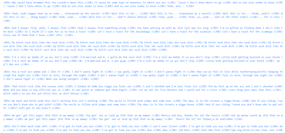
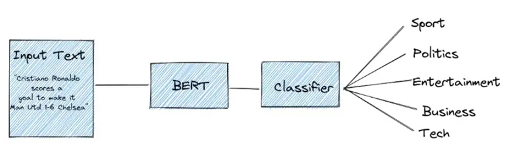
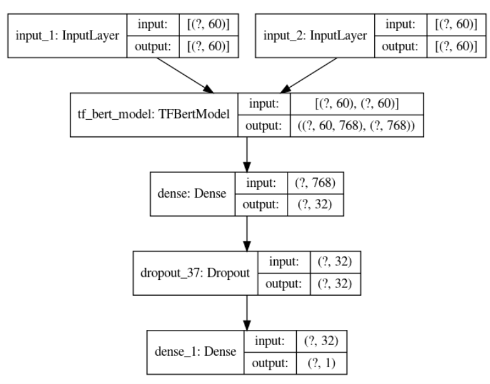

# RGPT-2: Rap Generator Based on GPT-2

Authors:
- Kurtis Shen
- Hsueh-Yi Lu

Columbian College of Arts & Sciences
George Washington University
Washington, DC 20052

Emails:
- lootlecoop@gwmail.gwu.edu
- hsuehyi_lu2580@gwmail.gwu.edu

## Abstract

This project aims to generate rap verses that are humanly realistic enough to be distinguishable from other genres. Our model, RGPT-2, is based on fine-tuning the GPT-2 text generation model, with a unique approach inspired by the GPoet-2 model. Instead of using just one model, we utilize a two-model consecutive generating process. The second model is trained on the reversed training texts, capturing more structure within a verse. Our model can generate hyper-human-like rap verses that easily fit into the hip-hop genre.

## Introduction

NLP is a developing technology with many challenges. In this project, we aim to train a language generation model to create rap lyrics. By training on rap lyrics data and using a classification model, we can determine if the generated sentences are rap lyrics.

## Related Work

### Language Generation

Natural language generation (NLG) is a software process that produces human-like text output. NLG is a subfield of AI and computational linguistics focused on constructing computer systems that can generate understandable texts in human languages.

## Datasets

### Source

The dataset used in this project is from the Hip-Hop Encounters Data Science and Music Genre Classification from Kaggle. The dataset includes rap lyrics and their related music genre (rap or pop) sourced from Genius.com.

### Text Generation

Training and validation sets are retrieved from a public open-source GitHub repository (fpaupier, 2018). The dataset consists of lyrics from 39 different artists, with songs and verses separated by lines.

### Genre Classification

Training and testing sets for genre classification are retrieved from the music platform Genius.com. The dataset contains lyrics samples labeled with music genres (pop or hip-hop).

## Preprocessing

The dataset is processed by splitting songs, verses, and bars (sentences) to create a list of lists representing verses. The dataset is divided into training and validation sets for unconditional text generation.

## Models

### Inspiration

Our model is based on GPT-2, a text generation model created by OpenAI. We were also inspired by the GPoet-2 model, which generates limericks. We utilized the idea of training the text in reverse to capture the structure of rap verses.

### Framework

To implement this idea. We trained the standard GPT-2 model on our lyrics set. Then we trained the standard GPT-2 model again on the reversed dataset, reversed being each sentence was reversed with the last word now being the first, while sentence position within the verse (paragraph) remains the same. After training, unconditional texts were generated using the model trained on standard-order texts. However, during the generation phase, only the first line was generated by the standard model, since it specializes at producing more diversified topics than the reversed one. Then subsequent lines were generated inputting the first line using the reverse-order model.

### Classification Model

We use a combined model that includes a BERT model as the base model and a classifier model for the final output. BERT is a pre-trained transformer-based model for natural language processing (NLP) developed by Google. It is trained on a large corpus of unlabeled data from BooksCorpus and Wikipedia, which allows it to learn bidirectionally from word sequences.

## Results

After testing, 87% of the generated lyrics were classified as rap music lyrics by the classification model. The model showed promising performance in distinguishing rap lyrics from other genres. However, further improvements can be made by increasing the amount of training data and considering additional indicators for classification.

## Summary

Overall, our project was considered a success based on the results. The RGPT-2 model demonstrated the ability to generate rap lyrics that were classified as such by our classification model. Further improvements can be made by expanding the dataset and considering additional indicators for classification.

## References

- [fpaupier. (2018). RAP_lyrics_generation](https://github.com/fpaupier/RAP_lyrics_generation)
- [Hip-Hop Encounters Data Science and Music Genre Classification](https://www.kaggle.com/columbiau2745/hip-hop-encounters-data-science-and-music-genre)
- [OpenAI GPT-2](https://openai.com/blog/gpt-2-1-5b-release/)
- [Google AI Blog: BERT](https://ai.googleblog.com/2018/11/open-sourcing-bert-state-of-art-pre.html)
